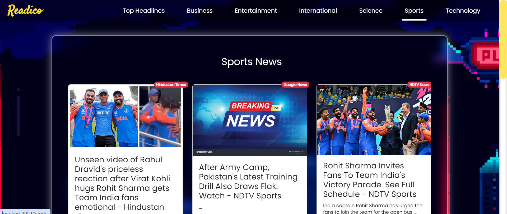
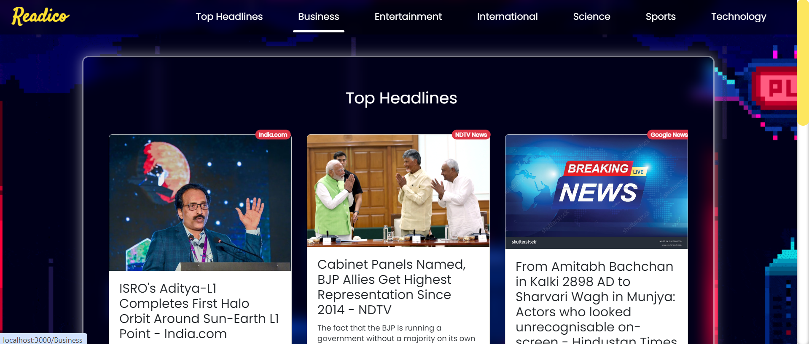
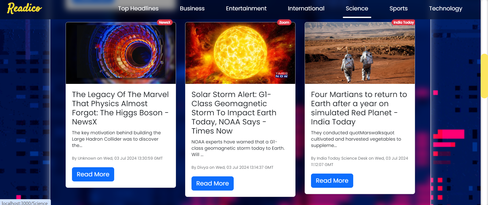

# Readics

## Overview

Readics is a web application designed to deliver up-to-date news articles across various categories. Users can browse news headlines, explore different topics such as **Business, Entertainment, Science, Sports, Technology**, and more.

## Features

- **Navigation:** Navigate through different news categories using the top navigation bar.
- **Responsive Design:** Mobile-friendly interface for seamless browsing on all devices.

## Technologies Used

- React
- React Router
- News API
- Bootstrap (for styling)

## Screenshots 

## Acknowledgements

This project utilizes the **News API** for fetching news data.

## Contact

For any inquiries or feedback, please contact us at **adrijadastidar@gmail.com**.

## Contributing

Contributions are welcome! If you have any suggestions, feature requests, or find any issues, please create a GitHub issue or submit a pull request.
